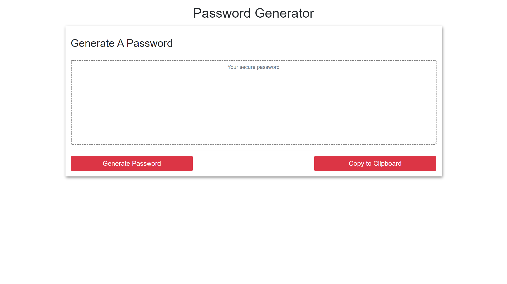
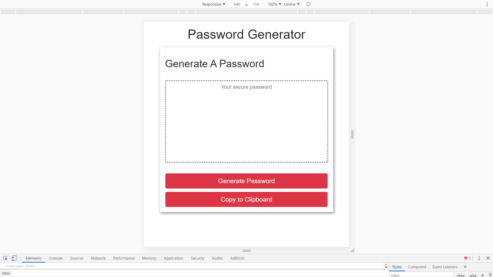

# Password Generator

## Description

This website creates a randomly-generated password based on user preferrences. The user first chooses the length the password (between 8 and 128), then the user chooses the character types they would like to include in their password (special, numeric, lowercase, and uppercase). After the user has made their choice, the password is printed on the textbox. The user may then press a button to copy the password onto the clipboard.

## Technologies Used

* [HTML](https://developer.mozilla.org/en-US/docs/Web/HTML)
* [CSS](https://developer.mozilla.org/en-US/docs/Web/CSS)
* [Javascript](https://developer.mozilla.org/en-US/docs/Web/JavaScript)
* [Bootstrap](https://getbootstrap.com/)
* [Git](https://git-scm.com/)
* [GitHub](https://github.com/)
* [VSCode](https://code.visualstudio.com/)

## Deployed Link

* [https://yjmiranda.github.io/password-generator/]

## Code Snipet

```
//Returns a random character within a string.
function randomCharacter(str){
    return str.charAt(Math.floor(Math.random()*str.length));
}

//Returns a random element within an array.
function randomString(arr){
    return arr[Math.floor(Math.random()*arr.length)];
}

var password = ""; //empty string to be filled in later

var passwordLength = prompt("How many characters would you like your password to contain?");

if (passwordLength >= PASSWORD_MIN && passwordLength <= PASSWORD_MAX){

    confirmSpecial = confirm("Click OK to confirm special characters.");
    confirmNumeric = confirm("Click OK to confirm numeric characters.");
    confirmLowercase = confirm("Click OK to confirm lowercase characters.");
    confirmUppercase = confirm("Click OK to confirm uppercase characters.");

    if (confirmSpecial && confirmNumeric && confirmLowercase && confirmUppercase){

        characterPool = [special, numeric, lowercase, uppercase];

        for(var i = 0; i < passwordLength; i++){
            password = password.concat(randomCharacter(randomString(characterPool)));
        }
    }
```
This is a portion of the javascript file. The chosen length is stored into variable. If that variable's value is within the preset minimum and maximum the code will run. Next, it stores four Boolean values. The Booleans are used in a conditional statement to determine whick strings are stored into the characterPool array. The array is then used as a source for random characters using the predefined functions. The randomString function chooses a random string within the characterPool array, and the randomCharacter function chooses a random character within that string.

## Screenshots

Two screenshots at different widths.





## Author

**Yalí Miranda** 

* [Github](https://github.com/yjmiranda)